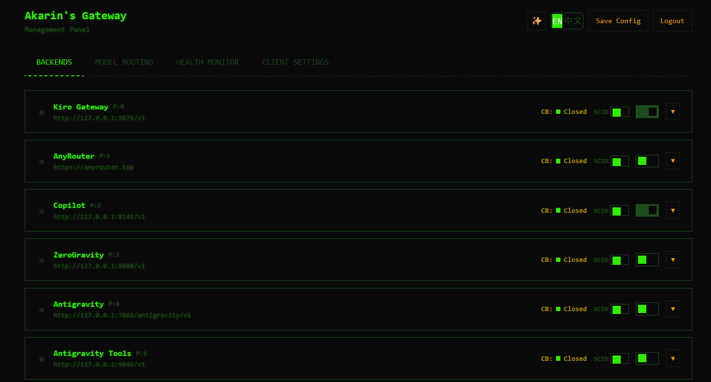
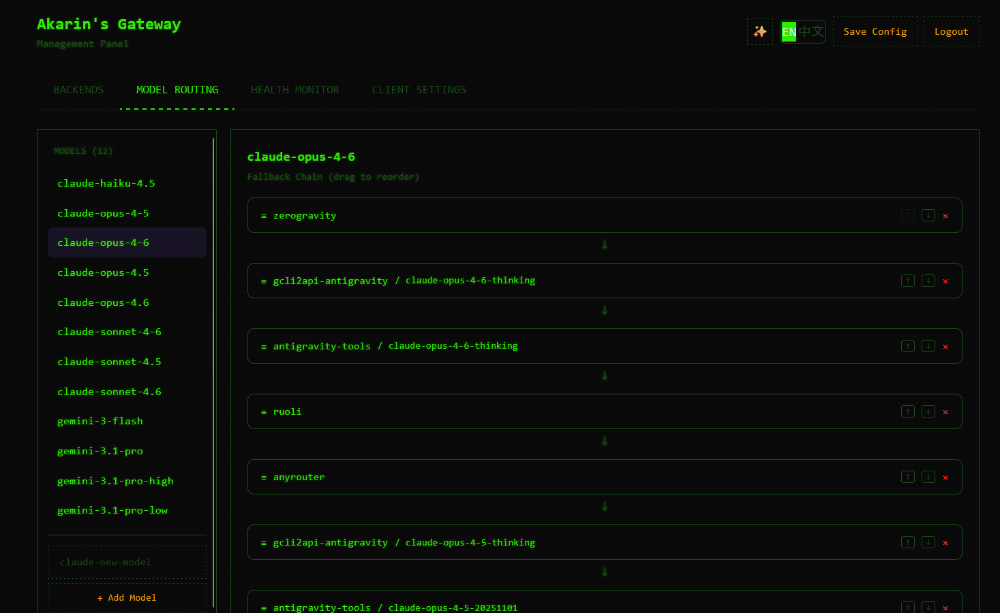
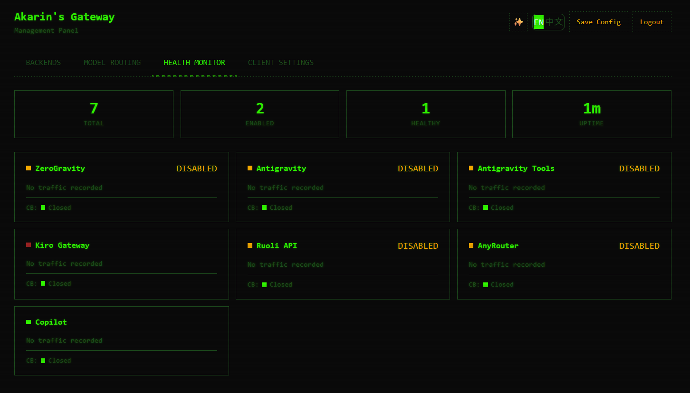

**[English](README.md)** | **[简体中文](README_CN.md)**

# Akarins Gateway

高性能、数据驱动的 API 网关，将多个 AI 后端供应商统一在 **OpenAI 兼容**接口之后。通过单一 YAML 文件配置，实现跨 7+ 后端的请求路由、自动降级、熔断保护和 IDE 感知优化。

## 管理面板

内置基于 Web 的管理面板，可实时配置后端、模型路由，并监控健康状态。

| 后端管理 | 模型路由 | 健康监控 |
|:--------:|:--------:|:--------:|
|  |  |  |

## 特性

### 多后端路由

- **7+ 后端供应商** — ZeroGravity、Antigravity、Copilot、Kiro、公共站点等
- **优先级调度** — 每个后端可配置优先级（p0–p4）
- **按模型降级链** — 例如 Claude Opus 4.6 可级联最多 16 个后端步骤
- **跨模型降级** — 当某模型的所有后端均失败时，自动切换到其他模型族（Claude → Gemini）

### 数据驱动配置

- **YAML 驱动路由** — 所有路由规则、后端能力声明、降级链均在 `config/gateway.yaml` 中定义
- **模式匹配** — `fnmatch` 风格通配符（`claude-*haiku*`、`gemini-*`、`gpt-*`）
- **后端能力声明** — include/exclude 模式控制每个后端支持的模型范围
- **零代码变更** — 添加或调整后端仅需编辑 YAML

### 可靠性

- **熔断器** — 防止后端故障级联扩散
- **指数退避重试** — 支持解析 `Retry-After` 响应头
- **防环保护** — 已访问后端追踪，最大深度 20 层
- **健康探测** — 定期检测后端可用性

### IDE 与客户端兼容

- **客户端识别** — 自动检测 Claude Code、Cursor、Windsurf、Augment 等 IDE 客户端
- **消息清洗** — 按客户端类型清理和规范化请求
- **SCID 追踪** — 会话关联 ID，用于请求链路追踪
- **历史缓存** — 长对话智能消息选择（LRU 后端，200KB 请求体上限）
- **工具语义转换** — 向上游隐藏 Claude Code 的工具指纹特征

### 协议支持

- **OpenAI 兼容 API** — `POST /v1/chat/completions`，Bearer Token 认证
- **Augment Code 兼容** — `POST /gateway/chat-stream`，SSE 转 NDJSON
- **SSE 流式传输** — 完整的 Server-Sent Events 支持，含工具名反向映射
- **TLS 指纹伪装** — 通过 `curl_cffi`（chrome131）实现反检测

## 架构深入解析

### SCID：会话关联标识符（自研）

大多数 AI IDE 客户端（Cursor、Windsurf 等）不会发送稳定的 `conversation_id`。Akarins Gateway 通过自研的 **SCID** 系统解决这一问题——即使客户端未提供任何标识，也能生成稳定的会话标识符。

**多策略 SCID 生成**（7 级优先级瀑布）：

| 优先级 | 来源 | 稳定性 | 说明 |
|--------|------|--------|------|
| 1 | `X-AG-Conversation-Id` 请求头 | 最高 | 客户端提供，最可靠 |
| 2 | `X-Conversation-Id` 请求头 | 高 | 备选客户端请求头 |
| 3 | 请求体中的 `conversation_id` | 高 | Body 级标识符 |
| 4 | 首条用户消息 + 客户端 IP | 高 | SHA256 指纹，对 checkpoint 友好 |
| 5 | 仅首条用户消息 | 中 | 跨回滚稳定 |
| 6 | 客户端 IP + 时间窗口 | 低 | 60 分钟窗口兜底 |
| 7 | 随机 UUID | 兜底 | 最后手段 |

**关键设计决策**：
- **Checkpoint 友好**：使用*第一条有效业务用户消息*生成指纹——该消息即使在 checkpoint 回退时也很少变化，相比之前的"前 3 条消息"方案更稳定
- **IDE 元信息清洗**：自动剥离 Cursor 等 IDE 注入的 `<user_info>`、`<environment_context>` 和 OS/工作区前缀后再生成指纹
- **动态检查点间隔**：自适应保存流状态（初始每 2 个 chunk → 5 → 10），防止流中断导致签名丢失
- **增量状态缓存**：实时增量写入，而非流结束时批量回写

### IDE 兼容层

一套中间件系统，可检测并适配 11 种不同的 AI 编程客户端，每种客户端都有不同的特性和需求。

**支持的客户端**：

| 客户端 | 检测方式 | 消息净化 | 跨池降级 | 状态模式 |
|--------|---------|:-------:|:-------:|----------|
| Claude Code | UA 模式 + `anthropic-claude` | 否 | 是 | 仅签名恢复 |
| Cursor | UA `cursor/` 或 `go-http-client/` | 是 | 否 | 完整 SCID |
| Augment | UA `augment`/`bugment`/`vscode` + 特殊请求头 | 是 | 否 | 完整 SCID |
| Windsurf | UA `windsurf/` | 是 | 否 | 完整 SCID |
| Cline | UA `cline/`/`claude-dev` | 是 | 是 | 无状态 |
| Continue.dev | UA `continue/` | 是 | 是 | 无状态 |
| Aider | UA `aider/` | 是 | 是 | 无状态 |
| Zed | UA `zed/` | 是 | 否 | 完整 SCID |
| GitHub Copilot | UA `github-copilot` | 是 | 否 | 完整 SCID |
| OpenAI SDK | UA `openai-python/`/`openai-node/` | 否 | 是 | 无状态 |

**按客户端行为自适应**：
- **消息净化**：IDE 客户端可能破坏 `thinking` 块——中间件在请求到达路由层之前拦截并清洗
- **无状态模式**：CLI 工具（Cline、Aider、Continue.dev）自行管理状态，网关完全绕过 SCID 会话追踪
- **仅签名恢复**：Claude Code 需要 thinking 签名恢复但不需要完整 SCID 状态管理——一种轻量级混合模式
- **跨池降级**：无状态 CLI 工具允许跨池降级；有状态 IDE 客户端禁止，以防止会话损坏

### Cursor 抓包重放拦截与权威历史（自研）

Cursor（及类似 IDE 客户端）每次发送新请求时都会携带**完整的对话历史** —— 本质上就是"抓包重放"。然而在重放过程中，Cursor 会以多种方式**破坏**消息，导致不符合 Anthropic 的 API 要求：

| 破坏类型 | 具体表现 | 后果 |
|---------|---------|------|
| **Thinking 块变形** | `\r\n`→`\n`、尾部空格裁剪、内容截断 | `400 Invalid signature in thinking block` — 签名与精确字节序列绑定 |
| **签名丢失** | `thoughtSignature` 字段被静默剥离 | 无法验证 thinking 块，Extended Thinking 被禁用 |
| **工具链断裂** | 发送 `tool_use` 但丢失对应的 `tool_result` | `400 tool_use_result_mismatch` — 对话中断 |
| **无会话标识** | Cursor 从不发送 `conversation_id` | 无法将请求关联到同一会话 |

网关通过成为**权威状态机**来解决以上所有问题 —— 永远不信任 IDE 回放的历史，维护自己的干净副本。

**核心设计原则**：*"网关是唯一的真相来源。客户端回放的历史被视为不可信输入。"*

#### 数据流

```
Cursor 请求（携带被破坏的重放历史）
    │
    ├──► IDE 兼容中间件 ──► 检测客户端类型（Cursor）
    │
    ├──► SCID 生成器 ──► 生成稳定的会话 ID
    │    (7 级瀑布)        基于第一条有效业务用户消息
    │
    ├──► Anthropic 净化器 ──► 6 层签名恢复
    │    (sanitizer.py)        ├─ 客户端提供的签名
    │                          ├─ 上下文中的签名
    │                          ├─ 编码 tool_id 解码
    │                          ├─ Session 缓存 (sig, text) 配对
    │                          ├─ Tool 缓存: tool_id → sig
    │                          └─ 最后已知签名（兜底）
    │                          全部失败 → thinking 降级为 text
    │
    ├──► 状态管理器.merge ──► 用权威版本替换被破坏的历史
    │    (state_manager.py)    ├─ 位置+角色匹配: 使用权威版本
    │                          ├─ 新消息: 追加客户端消息
    │                          ├─ 孤儿 tool_use: 从缓存或权威
    │                          │   历史中恢复 tool_result
    │                          └─ 工具链分裂: 保留双方消息
    │
    ├──► 历史缓存 ──► 智能消息选择
    │    (history_cache.py)  (LRU + 固定锚点工具定义)
    │
    ▼
转发干净的请求到上游 LLM
    │
    ▼
流式回传响应
    ├─ 提取并缓存 thinking 签名（动态检查点: 2→5→10 chunks）
    ├─ 用干净的响应更新权威历史
    └─ 缓存 tool_use_id → tool_result 映射
```

#### 五大核心机制

**1. 权威历史存储**（`state_manager.py`）

每次 LLM 成功响应后，网关将干净的原始消息作为该会话的"权威历史"存储。当 Cursor 下次重放其被破坏的版本时，网关会**替换**它：

```python
# 对于权威历史覆盖范围内的位置 → 使用干净版本
if auth_msg.get("role") == client_msg.get("role"):
    merged.append(authoritative[i])  # 使用网关的干净副本
# 对于超出权威历史的新消息 → 接受客户端消息
for i in range(auth_len, len(client_messages)):
    merged.append(client_messages[i])
```

关键特性：
- **双层持久化**：内存缓存（快速）+ SQLite（跨重启持久化）
- **自动压缩已禁用**：保护工具链完整性 —— 仅在上游返回请求体过大错误时才触发紧急压缩
- **陈旧 SCID 碰撞检测**：当短消息新会话意外命中携带重工具链历史的旧 SCID 时，自动重置状态

**2. 6 层签名恢复**（`sanitizer.py`）

当 Cursor 剥离 thinking 签名时，网关在放弃前会尝试 6 种恢复策略：

```
第 1 层: 客户端提供的签名（极少可用）
第 2 层: 请求上下文中的签名
第 3 层: 从编码的 tool_id 解码
第 4 层: Session 缓存 — (signature, thinking_text) 配对查找
第 5 层: Tool 缓存 — tool_use_id → signature 映射
第 6 层: 最后已知签名（兜底）

全部失败 → 优雅降级: thinking 块 → text 块
            + 同步 thinkingConfig 与内容一致
```

最后 2 条 assistant 消息会获得更积极的恢复尝试，因为它们最可能在工具调用回合中被引用。

**3. 工具链完整性保护**（`state_manager.py`）

Cursor 在重放时经常破坏 `tool_use`/`tool_result` 配对。网关会检测并修复：

```
检测孤儿 tool_use（有 tool_call_id 但无匹配的 tool_result）
    │
    ├─ 第 1 步: 检查 tool_results_cache（按会话缓存，以 tool_use_id 为键）
    │   └─ 找到 → 在 tool_use 后注入缓存的 tool_result
    │
    └─ 第 2 步: 回退到权威历史
        └─ 在存储的历史中搜索匹配的 tool_result
            └─ 找到 → 合并到消息列表
```

网关还会在响应处理期间缓存每个 `tool_use_id → tool_result` 映射，为未来的重放破坏构建安全网。

**4. 增量流检查点**（`scid.py`）

流式传输期间，如果流被中断（网络问题、客户端断开），签名可能丢失。网关以动态间隔保存状态：

| 流阶段 | Chunk 范围 | 保存间隔 | 原因 |
|--------|-----------|---------|------|
| 初始阶段 | 0–50 | 每 2 个 chunk | 签名通常早期出现 |
| 正常阶段 | 50–200 | 每 5 个 chunk | 平衡性能 |
| 后期阶段 | 200+ | 每 10 个 chunk | 减少 I/O 开销 |

在下一次请求时，如果网关检测到未完成的会话，会从最后一个检查点恢复签名 —— 防止 thinking 被永久禁用。

**5. Thinking 块优雅降级**（`sanitizer.py`）

当所有恢复尝试都失败时，网关执行优雅降级而非让请求失败：

```
thinking 块（签名无效/缺失）
    → 转换为 text 块（保留内容，移除签名要求）
    → 同步 thinkingConfig（如无有效 thinking 块则禁用）
    → 请求继续处理，不会产生 400 错误
```

这确保了即使 Cursor 严重破坏了重放历史，对话也能继续进行。

### 上下文管理与压缩策略（自研）

IDE 客户端（尤其是 Cursor）每次请求都会重放**完整的对话历史**，历史会无限增长。网关必须在上游 token/body 限制内控制请求大小，同时**绝不破坏工具链或丢失推理上下文**。这通过一套保守的多层压缩架构来解决。

**核心设计原则**：*"永不删除消息。只压缩内容。工具链完整性是最高优先级。"*

#### 为什么禁用自动压缩

```python
AUTO_COMPRESS_ENABLED = False      # 已禁用 — 保护工具链
MAX_HISTORY_MESSAGES = 200         # 软限制，不是硬上限
COMPRESSED_KEEP_MESSAGES = 150     # 仅在紧急路径中使用
TOOL_RESULT_COMPRESSION_ENABLED = False  # 常规截断默认关闭
```

删除**任何**消息都可能破坏 `tool_use`/`tool_result` 配对，导致 `400 tool_use_result_mismatch` 错误。网关采用**仅内容压缩**策略 —— 缩减消息内部内容，但不移除消息本身。

#### 三层压缩架构

```
请求到达（可能携带 200+ 条消息）
    │
    ├──► 第 1 层：常规工具结果压缩（默认关闭）
    │   (_compress_tool_result)
    │   ├─ 规范化格式（Gemini → Anthropic）
    │   ├─ 启用时：截断工具结果到 5000 字符
    │   ├─ 添加 "[SCID compressed N chars]" 标记
    │   └─ 在合并和历史更新时应用
    │
    ├──► 第 2 层：权威历史压缩
    │   (_compress_authoritative_history)
    │   ├─ 当历史超过 200 条消息时触发
    │   ├─ ⚠️ 永不删除消息 — 只压缩内容
    │   ├─ 对所有消息迭代执行 _compress_tool_result
    │   └─ 所有消息保留，仅内容被截断
    │
    └──► 第 3 层：紧急压缩（最后手段）
        (trigger_emergency_compress)
        ├─ 仅在上游返回错误时触发：
        │   ├─ 413 Request Entity Too Large
        │   └─ 400 且错误信息包含 "too large" / "token limit" / "context length"
        ├─ 激进截断工具结果到 1000 字符
        ├─ 标记内容：{ _emergency_truncated: true }
        └─ 仍然保留所有消息 — 永不破坏工具链
```

**关键设计决策**：网关宁可让上游拒绝过大的请求然后应用紧急压缩，也不会主动删除消息冒工具链损坏的风险。

#### 带固定锚点的历史缓存

对于长对话，网关维护一个独立于权威状态的**完整历史缓存**，通过智能消息选择将请求控制在约 200KB 的 body 限制内。

```
完整对话历史（已缓存，不会被主动逐出）
    │
    ├──► 固定锚点（工具定义）
    │   ├─ 与普通消息分开存储
    │   ├─ 永不从 LRU 缓存中逐出
    │   ├─ 始终包含在每个后端请求中
    │   └─ 24 小时 TTL 清理过期锚点
    │
    └──► 智能消息选择（用于后端请求）
        ├─ 步骤 1：所有 system 消息（始终包含）
        ├─ 步骤 2：最近 N 条消息（默认 10）
        ├─ 步骤 3：重要的中间消息
        │   ├─ 用户消息优先（承载意图）
        │   ├─ 按内容长度评分（越长越重要）
        │   └─ 排序选择以填充剩余预算
        └─ 步骤 4：工具链完整性检查
            ├─ 每个 tool_use 必须有匹配的 tool_result
            ├─ 孤儿 tool_use/tool_result 被移除
            └─ 支持 OpenAI 和 Anthropic 两种格式
```

**请求体预算**：`≤ 200KB` — 通过 `HISTORY_CACHE_MAX_MESSAGES_DEFAULT=20`（普通）和 `HISTORY_CACHE_MAX_MESSAGES_TOOL=40`（工具密集型对话）控制。

### 多层缓存架构（自研）

网关使用三层缓存架构存储 thinking 签名、会话状态和流检查点 —— 为高并发读取和最终一致性写入而设计。

```
┌─────────────────────────────────────────────────────────────────┐
│                     缓存读取路径（热路径）                         │
│                                                                 │
│  请求 ──► L1 内存缓存 ──命中──► 立即返回                          │
│                │                                                │
│              未命中                                              │
│                │                                                │
│          L2 SQLite DB ──命中──► 提升到 L1，返回                   │
│                │                                                │
│              未命中                                              │
│                │                                                │
│          内容哈希缓存 ──► 前缀/规范化匹配                         │
│                │                                                │
│              未命中 ──► 缓存未命中，无可用签名                     │
└─────────────────────────────────────────────────────────────────┘

┌─────────────────────────────────────────────────────────────────┐
│                    缓存写入路径（异步）                           │
│                                                                 │
│  新签名 ──► L1 内存缓存（同步，立即写入）                         │
│              │                                                  │
│              └──► 异步写入队列 ──► L2 SQLite DB                  │
│                   ├─ 批量提交（100 条/1000ms）                    │
│                   ├─ 指数退避重试                                 │
│                   ├─ 队列溢出保护（最大 10K）                     │
│                   └─ 优雅关机时排空队列                           │
└─────────────────────────────────────────────────────────────────┘
```

#### L1：内存缓存

| 特性 | 详情 |
|------|------|
| 数据结构 | `OrderedDict` — O(1) 存取，LRU 排序 |
| 并发控制 | 自研 `RWLock` — 多读单写 |
| 淘汰策略 | LRU（默认），也支持 FIFO 和 LFU |
| TTL | 按条目过期，惰性清理 |
| 隔离 | 命名空间 + 会话 ID 双重隔离 |
| 跨命名空间兜底 | `get_by_thinking_hash_any_namespace()` — 命名空间变更时仍能找到签名 |
| 预热 | 启动时从 L2 预加载 |

#### L2：SQLite 数据库（WAL 模式）

五张表提供跨网关重启的持久化存储：

| 表名 | 用途 | 关键字段 |
|------|------|---------|
| `signature_cache` | thinking_hash → 签名映射 | `thinking_hash`, `signature`, `namespace`, `conversation_id` |
| `tool_signature_cache` | tool_use_id → 签名 | `tool_id`, `signature` |
| `session_signature_cache` | session_id → (签名, thinking_text) | `session_id`, `signature`, `thinking_text` |
| `conversation_state` | SCID → 权威历史 + 最后签名 | `scid`, `authoritative_history`, `last_signature` |
| `session_checkpoints` | 流中断恢复 | `scid`, `thinking_content`, `partial_response`, `signature` |

#### 内容哈希缓存（签名恢复加速器）

当 Cursor 破坏 thinking 文本（空白变更、尾部空格、内容截断）时，精确哈希查找会失败。内容哈希缓存提供**模糊匹配**以恢复签名：

```
来自 Cursor 的 thinking 文本（已被破坏）
    │
    ├──► 精确 SHA256 哈希查找 ──命中──► 返回签名
    │
    ├──► 规范化哈希查找 ──命中──► 返回签名
    │   （去除空白，规范化 \r\n → \n）
    │
    └──► 前缀匹配 ──命中──► 返回签名
        （前 100+ 字符匹配，处理截断场景）
```

| 特性 | 详情 |
|------|------|
| 双哈希策略 | 精确 SHA256 + 规范化 SHA256（空白不敏感） |
| 前缀匹配 | 最少 100 字符，处理 IDE 截断 thinking 内容的场景 |
| 容量 | LRU 淘汰，10,000 条目，1 小时 TTL |
| 命中追踪 | 三类计数器：`exact_hits`、`normalized_hits`、`prefix_hits` |

#### 缓存门面（统一接口）

`CacheFacade` 单例为所有缓存层提供统一 API，内置滚动升级迁移支持：

```
迁移阶段：
  LEGACY_ONLY → DUAL_WRITE → NEW_PREFERRED → NEW_ONLY

  - LEGACY_ONLY：仅读写旧缓存
  - DUAL_WRITE：同时写入新旧缓存，从旧缓存读取（安全过渡）
  - NEW_PREFERRED：同时写入，优先从新缓存读取
  - NEW_ONLY：旧缓存完全退役
```

### Augment Code 协议桥接

一个完整的协议翻译层，使网关能同时兼容 [Augment Code](https://www.augmentcode.com/)（内部代号 "Bugment"）和标准 OpenAI 接口。

```
Augment 客户端                         网关                            上游 LLM
    │                                    │                                │
    │  POST /gateway/chat-stream         │                                │
    │  (Augment 协议: nodes,             │                                │
    │   chat_history, tool_definitions)  │                                │
    │───────────────────────────────────>│                                │
    │                                    │  1. 解析 Bugment 协议          │
    │                                    │  2. 转换 nodes → messages      │
    │                                    │  3. 应用 Bugment State         │
    │                                    │     降级恢复 (chat_history,    │
    │                                    │     model 补全)                │
    │                                    │  4. 转换 tool_definitions      │
    │                                    │     → OpenAI tools 格式        │
    │                                    │  5. 规范化消息结构             │
    │                                    │     (确保 merge 兼容)          │
    │                                    │                                │
    │                                    │  POST /v1/chat/completions     │
    │                                    │  (OpenAI 格式)                 │
    │                                    │───────────────────────────────>│
    │                                    │                                │
    │                                    │  SSE 流式响应                  │
    │                                    │<───────────────────────────────│
    │                                    │                                │
    │  NDJSON 流式响应                   │  6. 转换 SSE → NDJSON          │
    │  (Augment 协议: TEXT,              │  7. 映射工具调用到             │
    │   TOOL_USE, STOP 节点)             │     Augment 节点类型           │
    │<───────────────────────────────────│                                │
```

**核心能力**：
- **Bugment State 管理**：按会话持久化 `chat_history` 和 `model`，客户端发送空字段时自动恢复
- **权威历史统一**：合并客户端发送的历史与服务端权威历史，优先使用更完整的来源
- **模式感知处理**：CHAT 模式禁用 thinking（快速响应）；AGENT 模式保留 thinking 配置
- **Tool Loop 支持**：将 Augment 的 `TOOL_RESULT` 节点转回 OpenAI 工具消息，支持多步骤工具调用工作流
- **限流保护**：Augment 端点按 IP 限流（100 请求/分钟）

## 快速开始

### 前置要求

- Python >= 3.11
- [uv](https://docs.astral.sh/uv/)（推荐）或 pip

### 安装

```bash
# 克隆仓库
git clone https://github.com/Akarin-Akari/akarins-gateway.git
cd akarins-gateway

# 使用 uv 安装（推荐）
uv sync

# 或使用 pip
pip install -e .
```

### 配置

1. 复制环境变量模板：

```bash
cp .env.example .env
```

2. 编辑 `.env` 填入你的配置：

```env
# 服务器
HOST=0.0.0.0
PORT=7861
API_PASSWORD=your-api-password

# 代理（可选）
SOCKS5_PROXY=socks5://127.0.0.1:1080

# TLS 指纹
TLS_IMPERSONATE=chrome131
```

3. 编辑 `config/gateway.yaml` 配置后端、路由规则和降级链（详见下方[配置指南](#配置指南)）。

### 启动

```bash
# 通过入口点启动
akarins-gateway

# 或通过 Python 模块启动
python -m akarins_gateway.server
```

服务器默认启动在 `http://0.0.0.0:7861`。如果端口被占用，会自动尝试相邻端口。

## API 端点

| 方法 | 路径 | 说明 |
|------|------|------|
| `POST` | `/v1/chat/completions` | OpenAI 兼容的对话补全（支持流式与非流式） |
| `GET`  | `/v1/models` | 列出所有后端的可用模型 |
| `POST` | `/gateway/chat-stream` | Augment Code 兼容端点（SSE → NDJSON） |

### 请求示例

```bash
curl -X POST http://localhost:7861/v1/chat/completions \
  -H "Content-Type: application/json" \
  -H "Authorization: Bearer your-api-password" \
  -d '{
    "model": "claude-sonnet-4-20250514",
    "messages": [{"role": "user", "content": "你好！"}],
    "stream": true
  }'
```

## 配置指南

### `config/gateway.yaml` 结构

```yaml
backends:
  zerogravity:
    base_url: "https://..."
    priority: 0              # 数值越小优先级越高
    enabled: true
    timeout: 120
    max_retries: 2
    capabilities:
      include: ["claude-*", "gemini-*"]   # 支持的模型模式
      exclude: ["*-embedding-*"]          # 排除的模型模式

routing:
  model_routing:             # 按模型的路由规则
    claude-opus-4-6:
      backends: [zerogravity, antigravity, copilot, ...]  # 降级链
    gemini-2.5-pro:
      backends: [zerogravity, ruoli, anyrouter]

  default_routing:           # 基于模式匹配的默认路由
    - pattern: "claude-*haiku*"
      backends: [zerogravity, copilot, anyrouter]
    - pattern: "gemini-*"
      backends: [zerogravity, ruoli, anyrouter]

  cross_model_fallback:      # 跨模型降级
    claude-opus-4-6: gemini-2.5-pro

  catch_all:                 # 兜底路由
    backends: [copilot]
```

### 环境变量

| 变量 | 默认值 | 说明 |
|------|--------|------|
| `HOST` | `0.0.0.0` | 服务器绑定地址 |
| `PORT` | `7861` | 服务器端口 |
| `API_PASSWORD` | — | API 认证 Bearer Token |
| `SOCKS5_PROXY` | — | SOCKS5 代理地址 |
| `TLS_IMPERSONATE` | `chrome131` | 要伪装的 TLS 指纹 |

## 架构

```
┌─────────────────────────────────────────────────────────────────┐
│                         客户端请求                                │
│              (Claude Code / Cursor / Augment / ...)              │
└──────────────────────────┬──────────────────────────────────────┘
                           │
                    ┌──────▼──────┐
                    │   认证门控   │
                    └──────┬──────┘
                           │
                ┌──────────▼──────────┐
                │   IDE 兼容中间件     │  客户端检测、SCID、
                │                     │  消息清洗
                └──────────┬──────────┘
                           │
                  ┌────────▼────────┐
                  │   历史缓存 &    │  智能消息选择、
                  │   请求规范化     │  工具语义转换
                  └────────┬────────┘
                           │
              ┌────────────▼────────────┐
              │      YAML 路由引擎      │  model_routing →
              │  (gateway.yaml 驱动)    │  default_routing →
              └────────────┬────────────┘  catch_all
                           │
          ┌────────────────┼────────────────┐
          │                │                │
    ┌─────▼─────┐   ┌─────▼─────┐   ┌─────▼─────┐
    │   后端     │   │   后端     │   │   后端     │   ...
    │ ZeroGrav  │   │  Copilot  │   │   Kiro    │
    │   (p0)    │   │   (p2)    │   │   (p2)    │
    └─────┬─────┘   └─────┬─────┘   └─────┬─────┘
          │                │                │
          │           熔断器保护             │
          │          重试 + 退避             │
          │           防环守卫              │
          │                │                │
          └────────────────┼────────────────┘
                           │
                    ┌──────▼──────┐
                    │  响应转换器   │  SSE 流式传输、
                    │             │  SSE→NDJSON (Augment)
                    └──────┬──────┘
                           │
                    ┌──────▼──────┐
                    │    客户端    │
                    └─────────────┘
```

## 项目结构

```
akarins_gateway/
├── server.py                 # Hypercorn 启动器，端口预检
├── app.py                    # FastAPI 应用工厂，生命周期管理，中间件
│
├── core/                     # 基础设施层
│   ├── auth.py               # API Key 认证
│   ├── config.py             # 配置加载
│   ├── constants.py          # 全局常量
│   ├── httpx_client.py       # 共享 HTTP 客户端池
│   ├── log.py                # 结构化日志
│   ├── rate_limiter.py       # 限流器
│   ├── retry_utils.py        # 重试工具
│   └── tls_impersonate.py    # TLS 指纹伪装
│
├── gateway/                  # 网关核心
│   ├── routing.py            # YAML 驱动的路由引擎
│   ├── circuit_breaker.py    # 熔断器模式
│   ├── model_registry.py     # 动态模型发现
│   ├── health.py             # 后端健康探测
│   ├── config_loader.py      # YAML 配置解析器
│   ├── scid.py               # 会话关联 ID
│   ├── normalization.py      # 请求规范化
│   ├── concurrency.py        # 并发控制
│   │
│   ├── backends/             # 后端实现
│   │   ├── interface.py      # 后端协议定义
│   │   ├── registry.py       # 后端注册中心
│   │   ├── zerogravity.py    # ZeroGravity 后端
│   │   ├── copilot.py        # Copilot 后端
│   │   ├── kiro.py           # Kiro 后端
│   │   ├── antigravity/      # Antigravity 系列后端
│   │   └── public_station/   # 公共站点后端
│   │
│   ├── endpoints/            # API 端点
│   │   ├── openai.py         # /v1/chat/completions
│   │   ├── models.py         # /v1/models
│   │   ├── anthropic.py      # Anthropic 格式端点
│   │   └── admin.py          # 管理端点
│   │
│   ├── augment/              # Augment Code 集成
│   │   ├── bridge.py         # SSE→NDJSON 桥接
│   │   ├── endpoints.py      # /gateway/chat-stream
│   │   └── nodes_bridge.py   # Node 风格兼容
│   │
│   └── sse/                  # Server-Sent Events
│       └── converter.py      # SSE 转换工具
│
├── converters/               # 消息与格式转换器
│   ├── message_converter.py  # 跨格式消息转换
│   ├── model_config.py       # 模型配置
│   ├── tool_converter.py     # 工具调用转换
│   ├── tool_semantic_converter.py  # 工具指纹隐藏
│   ├── signature_recovery.py # 签名恢复
│   └── gemini_fix.py         # Gemini 专项修复
│
├── cache/                    # 缓存层
│   ├── cache_facade.py       # 统一缓存接口
│   ├── memory_cache.py       # 内存 LRU 缓存
│   ├── signature_cache.py    # 签名缓存
│   ├── async_write_queue.py  # 异步写入队列
│   └── migration/            # 缓存迁移工具
│
├── ide_compat/               # IDE 兼容层
│   ├── middleware.py          # IDE 检测中间件
│   ├── client_detector.py    # 客户端类型识别
│   ├── history_cache.py      # 对话历史缓存
│   ├── sanitizer.py          # 消息清洗器
│   ├── state_manager.py      # 客户端状态管理
│   ├── hash_cache.py         # 哈希缓存
│   ├── cache_backends/       # 缓存后端实现
│   └── selection_strategies/ # 消息选择策略
│
└── augment_compat/           # Augment 协议兼容
    ├── routes.py             # Augment 路由定义
    ├── request_normalize.py  # 请求规范化
    ├── ndjson.py             # NDJSON 格式化
    ├── tools_bridge.py       # 工具调用桥接
    └── types.py              # Augment 专用类型
```

## 开发

### 环境搭建

```bash
# 安装开发依赖
uv sync --dev

# 或
pip install -e ".[dev]"
```

### 代码质量

```bash
# 代码检查
ruff check .

# 代码格式化
ruff format .

# 类型检查
pyright
```

### 测试

```bash
pytest
```

### 构建

```bash
# 构建分发包
python -m build

# 或使用 hatchling
hatch build
```

## 技术栈

| 组件 | 技术 |
|------|------|
| 运行时 | Python >= 3.11 |
| Web 框架 | FastAPI |
| ASGI 服务器 | Hypercorn |
| HTTP 客户端 | httpx（支持 SOCKS5） |
| TLS 伪装 | curl_cffi |
| 数据校验 | Pydantic |
| 配置管理 | PyYAML |
| 数据库 | aiosqlite（签名缓存） |
| 构建系统 | hatchling |

## 许可证

MIT License - 详见 [LICENSE](LICENSE)。

## 作者

**Akari** — [GitHub](https://github.com/Akarin-Akari)
